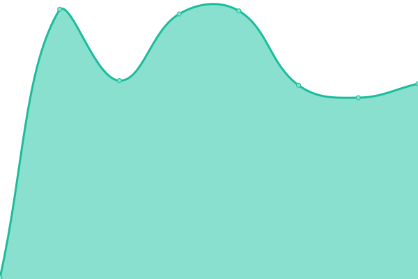
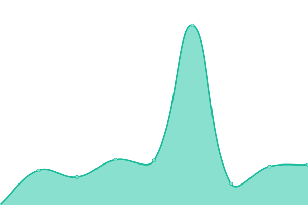

# [📈 Live Status](https://status.tokuzouserver.net): <!--live status--> **すべてのシステムが稼働しています**

This repository contains the open-source uptime monitor and status page for [TokuzouServer](https://tokuzouserver.com/), powered by [Upptime](https://github.com/upptime/upptime).

With [Upptime](https://upptime.js.org), you can get your own unlimited and free uptime monitor and status page, powered entirely by a GitHub repository. We use [Issues](https://github.com/TokuzouServer/status-page/issues) as incident reports, [Actions](https://github.com/TokuzouServer/status-page/actions) as uptime monitors, and [Pages](https://status.tokuzouserver.net) for the status page.

<!--start: status pages-->
<!-- This summary is generated by Upptime (https://github.com/upptime/upptime) -->
<!-- Do not edit this manually, your changes will be overwritten -->
<!-- prettier-ignore -->
| URL | Status | History | Response Time | Uptime |
| --- | ------ | ------- | ------------- | ------ |
|  [Accounts-Service](https://acc.tokuzouserver.net) | 稼働中 | [accounts-service.yml](https://github.com/TokuzouServer/status-page/commits/HEAD/history/accounts-service.yml) | 

 752ms
     
 | 

<a href="https://status.tokuzouserver.net/history/accounts-service">100.00%</a>
    

|  [Minecraft-同好会サーバー](doukoukai.tokuzouserver.net) | 稼働中 | [minecraft.yml](https://github.com/TokuzouServer/status-page/commits/HEAD/history/minecraft.yml) | 

 146ms
     
 | 

<a href="https://status.tokuzouserver.net/history/minecraft">100.00%</a>
    

|  [ochinchinippaiboy.com](http://ochinchinippaiboy.com/) | 稼働中 | [ochinchinippaiboy-com.yml](https://github.com/TokuzouServer/status-page/commits/HEAD/history/ochinchinippaiboy-com.yml) | 

 184ms
     
 | 

<a href="https://status.tokuzouserver.net/history/ochinchinippaiboy-com">100.00%</a>
    

<!--end: status pages-->

[**Visit our status website →**](https://status.tokuzouserver.net)

## 📄 License

- Powered by: [Upptime](https://github.com/upptime/upptime)
- Code: [MIT](./LICENSE) © [TokuzouServer](https://tokuzouserver.com/)
- Data in the `./history` directory: [Open Database License](https://opendatacommons.org/licenses/odbl/1-0/)
